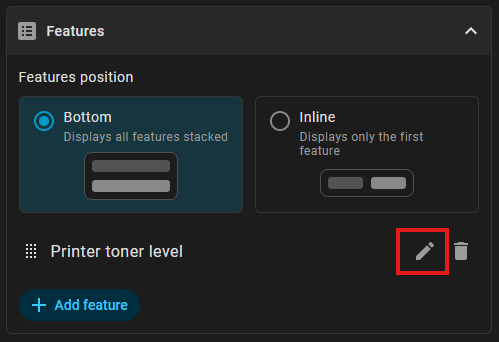

# Bosch Home Connect Alt features for Home Assistant Tile card

This collection of Tile card 'features' is used to display controls for various Bosch devices provided by [Home Connect Alt integration](https://github.com/ekutner/home-connect-hass).

TEMP IMAGE
