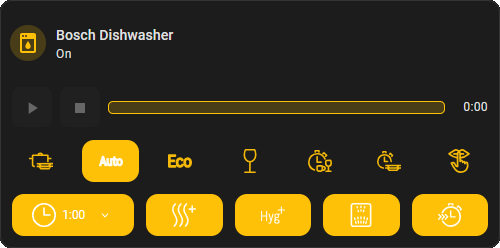
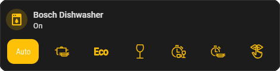
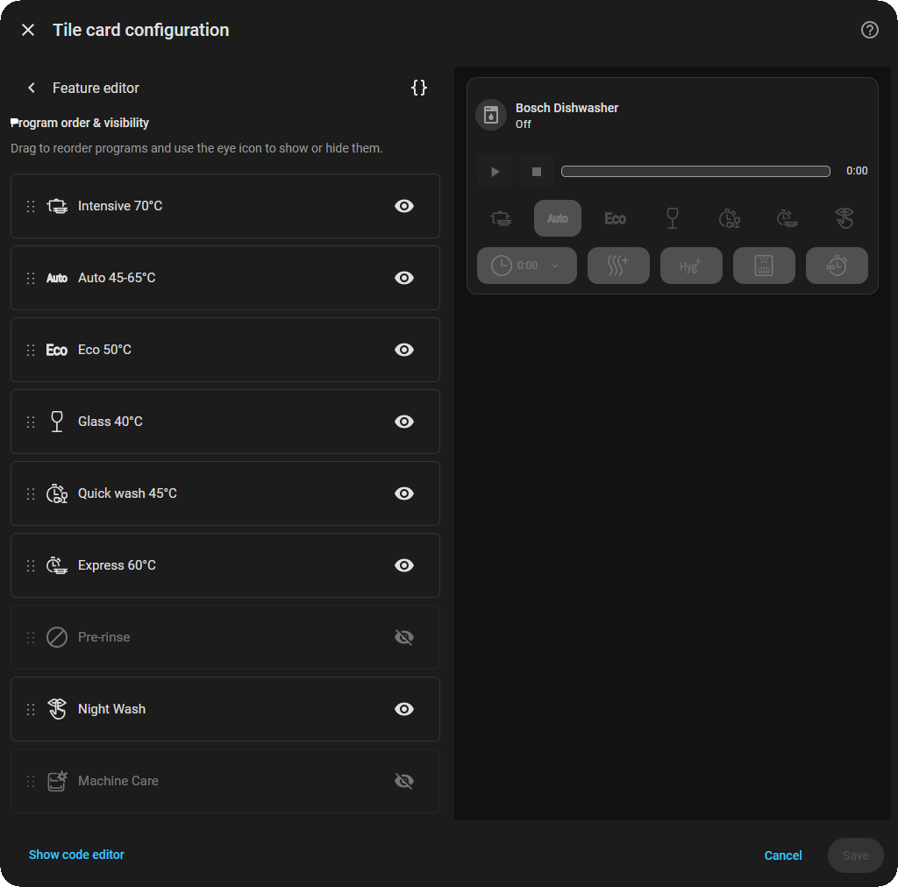
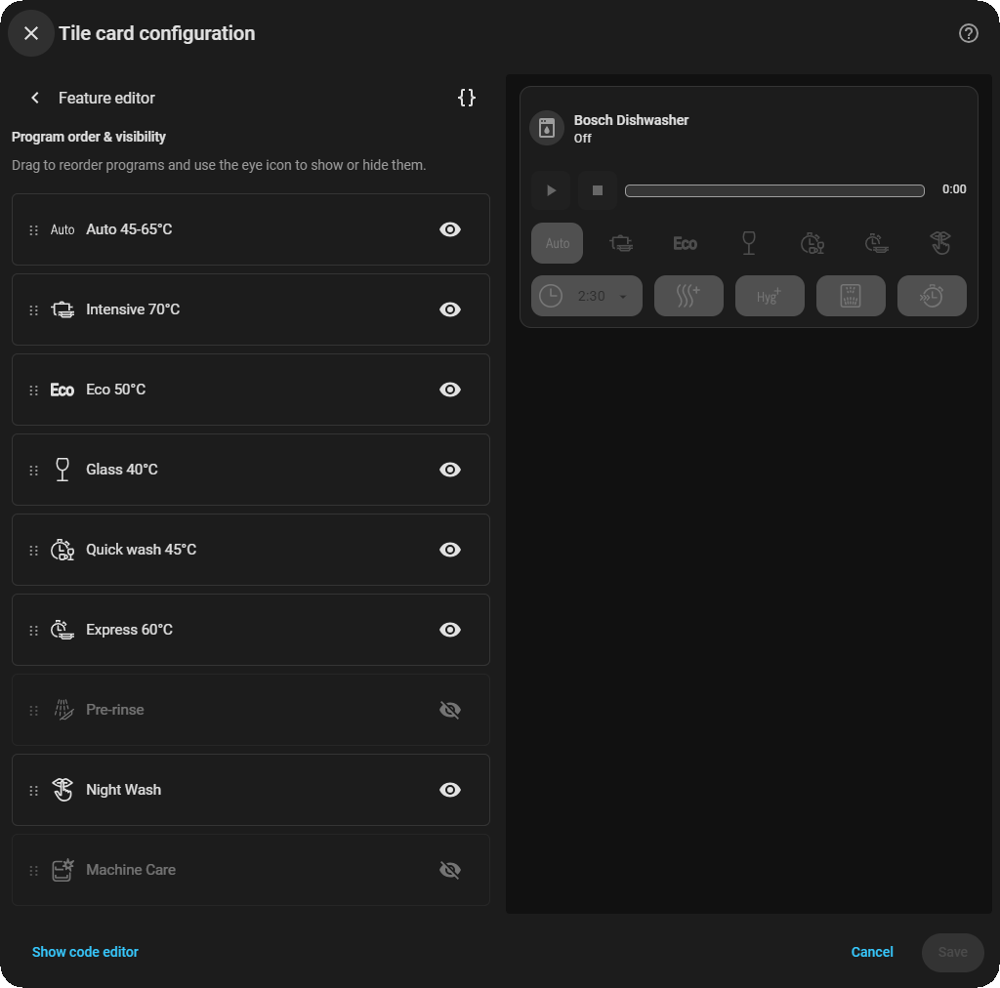
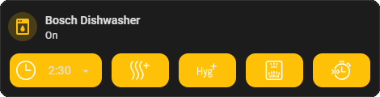
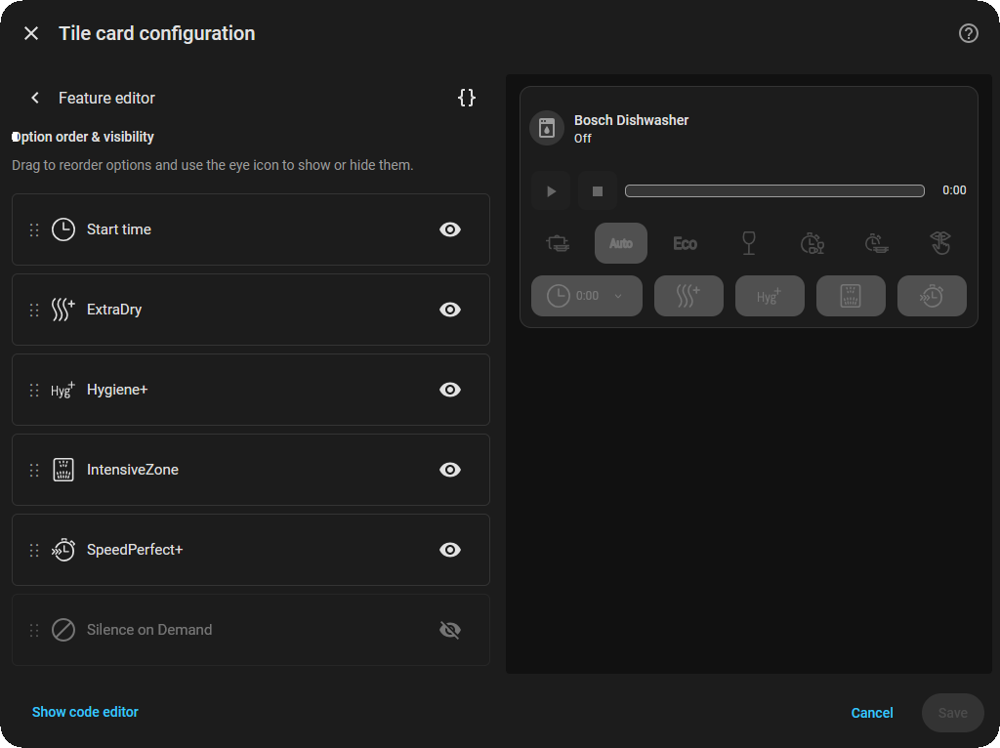
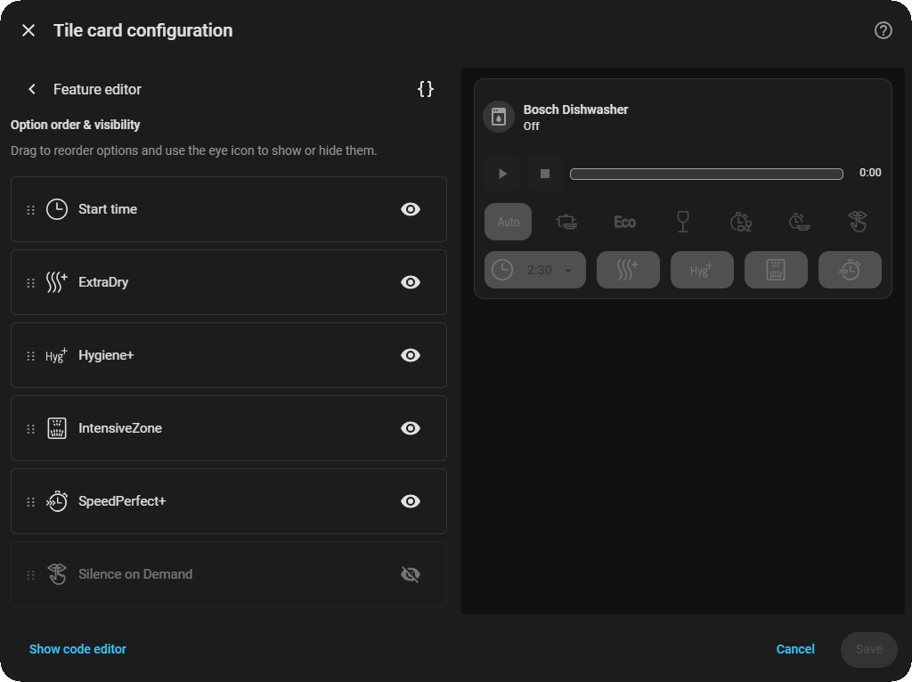
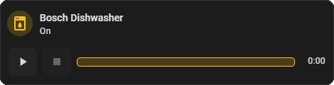
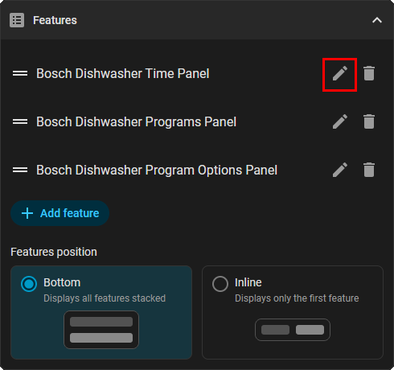
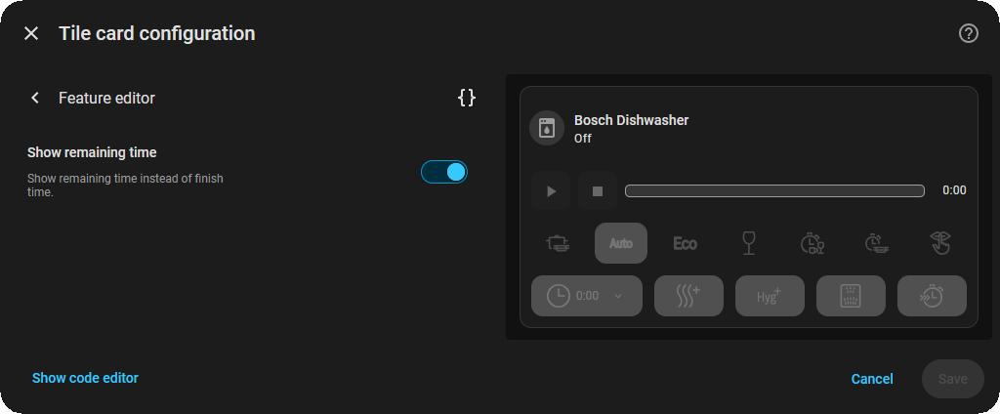

# Bosch Home Connect Alt features for Home Assistant Tile card

[](https://github.com/hondzik/bosch-appliance-features/releases)
[](LICENSE)
[](https://github.com/hondzik)

[](https://github.com/hondzik/bosch-appliance-features/commits/main)

This is a collection of Home Assistant Lovelace **Tile card features** that add Bosch-specific controls and status panels to a Tile card, the same way built-in features like "Cover open/close" or "Light brightness" attach to a Tile card. It's built for Bosch dishwashers exposed by the [Home Connect Alt integration](https://github.com/ekutner/home-connect-hass) (`home_connect_alt`).



## What's in this bundle

| Feature | Appliance | What it adds |
| ------- | --------- | ------------- |
| `bosch-dishwasher-programs-feature` | Dishwasher | A button bar to pick the active wash program. |
| `bosch-dishwasher-options-feature` | Dishwasher | A button bar to toggle program options (ExtraDry, Hygiene+, ...) plus a delayed-start control. |
| `bosch-dishwasher-time-feature` | Dishwasher | Start/pause/stop buttons, a progress bar and the remaining time. |

The dishwasher features read their program/option list **live from your device** rather than from a fixed per-model catalog, so they work on any Bosch dishwasher without a code change — including options your specific model exposes that this bundle doesn't otherwise know a nice name for (those still show up, just with a generic icon and their raw name). If you run into one, please let me know and I'll add the specific name and icon for it.

## Requirements

- The [Home Connect Alt integration](https://github.com/ekutner/home-connect-hass) (`home_connect_alt`) set up and working for your appliance.
- A Bosch dishwasher.

## Installation

Install through [HACS](https://hacs.xyz/) using the badge below, or add this repository manually as a custom HACS repository (category: plugin) if it isn't listed in the default store yet.

[](https://my.home-assistant.io/redirect/hacs_repository/?repository=bosch-appliance-features&owner=hondzik&category=Plugin)

## Adding a feature to a Tile card

Create a Tile card, point `entity` at any entity belonging to your dishwasher's device (e.g. its power-state switch), and add one or more of the features under `features:`. All three dishwasher features can be combined on the same card:

```yaml
type: tile
entity: switch.dishwasher_bsh_common_setting_powerstate
features_position: bottom
features:
  - type: custom:bosch-dishwasher-time-feature
  - type: custom:bosch-dishwasher-programs-feature
  - type: custom:bosch-dishwasher-options-feature
```

> If the button bar looks clipped or leaves dead space below it, increase the Tile card's `grid_options.rows` — how much room is needed depends on how many programs/options you leave visible.

The sections below cover each feature's own behavior and configuration in detail.

---

## Dishwasher programs



`type: custom:bosch-dishwasher-programs-feature`

### How it works

The feature reads the full list of programs your dishwasher supports directly off its `programs` select entity and renders them as a row of buttons — one per program.

- The currently selected program is highlighted.
- Clicking a different program sends the change to the appliance; the button shows a spinner while the change is pending.
- All buttons are disabled while the appliance is offline or while a cycle is already running.
- A program with no matching icon in this bundle falls back to a generic icon — it still works, it just doesn't have custom artwork yet.

### Configuration options

All options are settable either through YAML or the visual editor (pencil icon on the feature, see [below](#using-the-visual-editor)):

| Option | Type | Default | Description |
| ------ | ---- | ------- | ----------- |
| `program_order` | `string[]` | device order | The order programs are shown in, as short keys (e.g. `Eco50`, `Auto2`). Programs the device reports but that aren't listed here are appended at the end. |
| `program_hidden` | `string[]` | none hidden | Short keys of programs to hide from the button bar entirely. |

```yaml
features:
  - type: custom:bosch-dishwasher-programs-feature
    program_order:
      - Eco50
      - Auto2
      - NightWash
    program_hidden:
      - MachineCare
```

### Using the visual editor

Click the "Edit feature" (pencil) icon next to the feature in the card's feature list to open its settings:



The dialog shows every program your device reports as a draggable list: drag the handle to reorder, and use the eye icon to show or hide a program. Changes apply immediately, no separate save step needed.



---

## Dishwasher options



`type: custom:bosch-dishwasher-options-feature`

### How it works

Unlike programs, there's no single entity listing every option, so this feature scans all entities belonging to your dishwasher's device and picks out the ones that look like program options (e.g. ExtraDry, Hygiene+, SpeedPerfect+) plus the delayed-start ("start in ...") control, and renders them as a button bar.

- A toggle-style option lights up when it's on; clicking it toggles the underlying switch.
- The delayed-start control is a button plus a dropdown of the start times your appliance reports.
- Home Connect only allows switching some options depending on the currently selected program — an option showing up but greyed out/unclickable usually means it just isn't available for the current program, not that something is broken.
- An option this bundle doesn't have a friendly name for yet still shows up (using its raw name and a generic icon) — it never gets silently dropped.

### Configuration options

| Option | Type | Default | Description |
| ------ | ---- | ------- | ----------- |
| `option_order` | `string[]` | device order (delayed-start first, then alphabetical) | The order options are shown in, as short keys (e.g. `startinrelative`, `extradry`). Options the device reports but that aren't listed here are appended at the end. |
| `option_hidden` | `string[]` | none hidden | Short keys of options to hide from the button bar entirely. |

```yaml
features:
  - type: custom:bosch-dishwasher-options-feature
    option_order:
      - startinrelative
      - extradry
      - variospeedplus
    option_hidden:
      - silenceondemand
```

### Using the visual editor

Click the "Edit feature" (pencil) icon next to the feature in the card's feature list to open its settings:



The dialog shows every option your device reports as a draggable list: drag the handle to reorder, and use the eye icon to show or hide an option. Changes apply immediately, no separate save step needed.



---

## Dishwasher time



`type: custom:bosch-dishwasher-time-feature`

### How it works

Renders Start/Pause and Stop buttons, a progress bar for the running cycle, and the remaining time.

- Both buttons are disabled while the appliance is offline; Stop is additionally disabled unless a cycle is actually running.
- The progress bar reflects the appliance's own reported program progress — if your dishwasher doesn't report that, it falls back to an estimate based on elapsed vs. remaining time.

### Configuration options

| Option | Type | Default | Description |
| ------ | ---- | ------- | ----------- |
| `show_remaining_time` | `boolean` | `true` | Switches between showing the remaining time and the estimated finish time (clock time). |

```yaml
features:
  - type: custom:bosch-dishwasher-time-feature
```

### Using the visual editor

Click the "Edit feature" (pencil) icon next to the feature in the card's feature list to open its settings:



The dialog shows the `show_remaining_time` toggle that switches between showing the remaining time and the estimated finish time (clock time).



## Troubleshooting

- **A feature doesn't show up in the Lovelace feature picker at all** — it needs an entity whose `device_class` starts with `home_connect_alt_`; confirm the Tile card's `entity` actually comes from the Home Connect Alt integration.
- **A feature is pickable but renders nothing on the card** — the feature picker doesn't distinguish appliance types, so these features are technically selectable on any Home Connect Alt Tile card, but only render for a dishwasher.
- **Controls are permanently greyed out / unclickable even though the appliance is on** — this can happen if the integration's entity IDs for your specific device don't match the naming pattern this bundle expects when resolving related entities from the Tile card's own entity. If this happens, please open an issue with the entity IDs Home Connect Alt created for your device.
- **An option or program shows a generic icon instead of custom artwork** — expected for anything not yet in this bundle's icon set; it's still fully functional.

## Translations

The visual editors are localized into: Czech, German, English, Spanish, French, Hebrew, Hungarian, Italian, Japanese, Dutch, Norwegian, Polish, Portuguese, Slovak, Swedish, Ukrainian and Chinese (falls back to English for any other language). Don't see your language, or spot something wrong in an existing translation? Feel free to open an issue or PR — new translations are always welcome.

## Contributors

[](https://github.com/hondzik/bosch-appliance-features/graphs/contributors)
